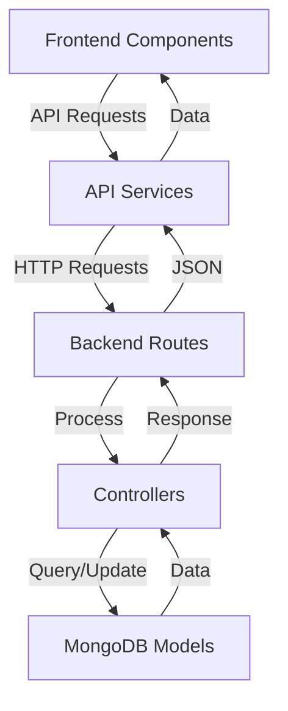

# 💰 Expense Tracker Pro

<div align="center">
  
  <h3>A Modern Full-Stack Expense Management Solution</h3>


</div>

## 🌟 Features

- 📊 Interactive Dashboard with Expense Analytics
- 💹 Real-time Budget Tracking
- 🎯 Savings Goals Management
- 📱 Responsive Design for All Devices
- 🔐 Secure User Authentication
- 📈 Visual Expense Reports & Charts
- 🔔 Smart Notifications & Reminders
- 🌙 Dark/Light Theme Support

## 🚀 Quick Start

### Prerequisites

- Node.js (v14 or higher)
- MongoDB
- npm or yarn

### Installation

1. **Clone the repository**

   ```bash
   git clone https://github.com/yourusername/expense-tracker.git
   cd expense-tracker
   ```

2. **Install Dependencies**

   ```bash
   # Install root dependencies
   npm install

   # Install client dependencies
   cd client && npm install

   # Install server dependencies
   cd ../server && npm install
   ```

3. **Environment Setup**

   ```bash
   # In server directory, create .env file
   cp .env.example .env

   # Configure your environment variables
   MONGO_URI=your_mongodb_uri
   JWT_SECRET=your_jwt_secret
   PORT=5000
   ```

4. **Start Development Servers**

   ```bash
   # From root directory
   npm run dev
   ```

   The application will be available at:

   - Frontend: `http://localhost:5173`
   - Backend: `http://localhost:5000`

## 🏗️ Project Structure

```
expense-tracker/
├── client/                  # Frontend React application
│   ├── src/
│   │   ├── assets/         # Static assets (images, icons, fonts)
│   │   │   ├── icons/      # SVG and icon files
│   │   │   └── images/     # Image resources
│   │   │
│   │   ├── components/     # Reusable UI components
│   │   │   ├── common/     # Shared components (Button, Input, etc.)
│   │   │   ├── layout/     # Layout components (Navbar, Footer, etc.)
│   │   │   └── forms/      # Form-related components
│   │   │
│   │   ├── context/        # React Context providers
│   │   │   ├── AuthContext.jsx    # Authentication context
│   │   │   └── ThemeContext.jsx   # Theme management
│   │   │
│   │   ├── hooks/          # Custom React hooks
│   │   │   ├── useAuth.js        # Authentication hook
│   │   │   └── useTheme.js       # Theme hook
│   │   │
│   │   ├── pages/          # Application pages/routes
│   │   │   ├── Dashboard/
│   │   │   ├── Expenses/
│   │   │   ├── Analytics/
│   │   │   └── Settings/
│   │   │
│   │   ├── services/       # API integration services
│   │   │   ├── api.js           # Axios instance & interceptors
│   │   │   ├── auth.service.js  # Authentication API calls
│   │   │   └── expense.service.js# Expense-related API calls
│   │   │
│   │   ├── styles/         # CSS and styling files
│   │   │   ├── base/       # Base styles, variables, mixins
│   │   │   ├── components/ # Component-specific styles
│   │   │   └── pages/      # Page-specific styles
│   │   │
│   │   ├── utils/          # Utility functions & helpers
│   │   │   ├── formatters.js    # Data formatting utilities
│   │   │   └── validators.js    # Form validation helpers
│   │   │
│   │   ├── App.jsx         # Main application component
│   │   └── main.jsx        # Application entry point
│   │
│   └── index.html          # HTML entry point
│
└── server/                  # Backend Node.js application
    ├── src/
    │   ├── config/         # Configuration files
    │   │   ├── db.js            # Database configuration
    │   │   └── env.js           # Environment variables
    │   │
    │   ├── controllers/    # Request handlers
    │   │   ├── auth.js          # Authentication controller
    │   │   ├── expense.js       # Expense controller
    │   │   └── user.js          # User controller
    │   │
    │   ├── middleware/     # Custom middleware
    │   │   ├── auth.js          # Authentication middleware
    │   │   └── error.js         # Error handling middleware
    │   │
    │   ├── models/         # Database models
    │   │   ├── User.js          # User model
    │   │   └── Expense.js       # Expense model
    │   │
    │   ├── routes/         # API routes
    │   │   ├── auth.js          # Authentication routes
    │   │   └── expense.js       # Expense routes
    │   │
    │   ├── utils/          # Utility functions
    │   │   ├── validation.js    # Input validation
    │   │   └── helpers.js       # Helper functions
    │   │
    │   └── app.js          # Express app setup
    │
    └── .env                # Environment variables
```

### 📁 Key Directories Explained

#### Frontend (`/client`)

- `components/`: Reusable UI building blocks
- `context/`: Global state management using React Context
- `hooks/`: Custom React hooks for shared logic
- `pages/`: Main application views/routes
- `services/`: API integration and data fetching
- `styles/`: CSS modules and styling files
- `utils/`: Helper functions and utilities

#### Backend (`/server`)

- `config/`: Application configuration
- `controllers/`: Business logic and request handling
- `middleware/`: Custom Express middleware
- `models/`: MongoDB schema definitions
- `routes/`: API endpoint definitions
- `utils/`: Helper functions and utilities

## 🔄 Data Flow



## 🔒 API Endpoints

### Authentication

```http
POST   /api/auth/register   # Register new user
POST   /api/auth/login      # Login user
GET    /api/auth/me         # Get current user
```

### Expenses

```http
GET    /api/expenses        # Get all expenses
POST   /api/expenses        # Create new expense
PUT    /api/expenses/:id    # Update expense
DELETE /api/expenses/:id    # Delete expense
```

### Budgets

```http
GET    /api/budgets        # Get all budgets
POST   /api/budgets        # Create new budget
PUT    /api/budgets/:id    # Update budget
DELETE /api/budgets/:id    # Delete budget
```

## 🎨 Screenshots

<div align="center">
  
  
</div>

## 🛠️ Tech Stack

### Frontend

- React (Vite)
- React Router DOM
- Axios
- Chart.js
- CSS Modules

### Backend

- Node.js
- Express.js
- MongoDB
- JWT Authentication
- Bcrypt

## 📱 Mobile Support

The application is fully responsive and provides a seamless experience across all devices:

- 💻 Desktop
- 📱 Mobile
- 📟 Tablet

## 🤝 Contributing

1. Fork the repository
2. Create your feature branch (`git checkout -b feature/AmazingFeature`)
3. Commit your changes (`git commit -m 'Add some AmazingFeature'`)
4. Push to the branch (`git push origin feature/AmazingFeature`)
5. Open a Pull Request

## 📜 License

This project is licensed under the MIT License - see the [LICENSE](LICENSE) file for details.

## 👏 Acknowledgments

- [React Documentation](https://reactjs.org/)
- [MongoDB Documentation](https://docs.mongodb.com/)
- [Express.js Documentation](https://expressjs.com/)
- [Node.js Documentation](https://nodejs.org/)

## 📞 Contact

Njenga J

Project Link: [https://github.com/yourusername/expense-tracker](https://github.com/yourusername/expense-tracker)

---

<div align="center">
  Made with ❤️ by Shelby
</div>
